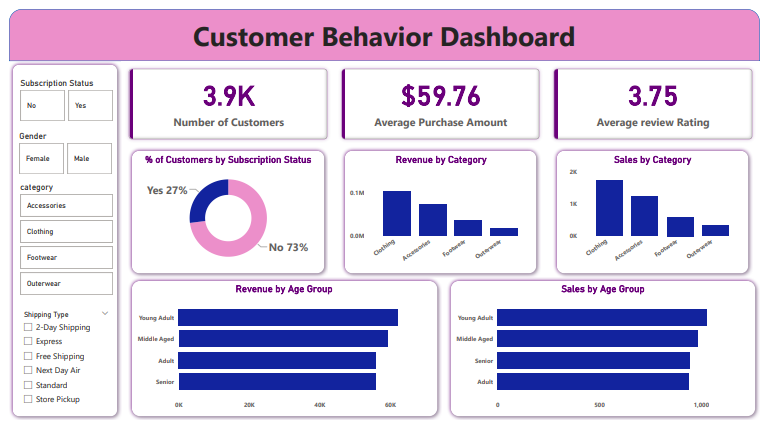

# Customer Shopping Behavior Analysis

A comprehensive data analytics project analyzing customer shopping trends and behaviors using Python and SQL. This project explores purchasing patterns, customer segmentation, and key business insights from customer transaction data.

## 📋 Project Overview

This project analyzes a dataset of 3,900+ customer shopping transactions to uncover valuable insights about customer behavior, purchase patterns, and revenue drivers. The analysis combines data cleaning, exploratory data analysis (EDA), and SQL-based business intelligence queries to answer critical business questions.

## 📊 Dataset

**File:** `customer_shopping_behavior.csv`

The dataset contains 3,901 customer transaction records with the following features:

- **Customer ID**: Unique identifier for each customer
- **Age**: Customer age
- **Gender**: Customer gender (Male/Female)
- **Item Purchased**: Product name
- **Category**: Product category (Clothing, Footwear, etc.)
- **Purchase Amount (USD)**: Transaction amount in USD
- **Location**: Customer location (US states)
- **Size**: Product size (S, M, L, XL)
- **Color**: Product color
- **Season**: Season of purchase (Winter, Spring, Summer, Fall)
- **Review Rating**: Product review rating (1-5 scale)
- **Subscription Status**: Whether customer has a subscription (Yes/No)
- **Shipping Type**: Shipping method (Express, Standard, Free Shipping, Next Day Air)
- **Discount Applied**: Whether discount was applied (Yes/No)
- **Promo Code Used**: Whether promo code was used (Yes/No)
- **Previous Purchases**: Number of previous purchases
- **Payment Method**: Payment method used (Credit Card, PayPal, Venmo, Cash, etc.)
- **Frequency of Purchases**: Purchase frequency (Weekly, Fortnightly, Monthly, Quarterly, Annually)

## 🛠️ Technologies Used

- **Python 3.x**
  - pandas - Data manipulation and analysis
  - SQLAlchemy - Database connection and ORM
  - PyMySQL - MySQL database driver
  
- **MySQL** - Database management and SQL queries

- **Jupyter Notebook** - Interactive data analysis environment

- **Power BI** - Interactive dashboard for data visualization

## 📁 Project Structure

```
Customer Trends Data Analysis/
│
├── customer_shopping_behavior.csv          # Raw dataset
├── Customer_Shopping_Behaviour_Analysis.ipynb  # Python analysis notebook
├── Customer_Shopping_Behavior.sql          # SQL queries for business insights
├── Customer_Behavior_Dashboard.pbix        # Power BI dashboard file
└── README.md                               # Project documentation
```

## 🔍 Analysis Workflow

### 1. Data Cleaning & Preprocessing (Python)

- **Data Loading**: Imported dataset using pandas
- **Missing Values**: Handled missing `Review Rating` values by filling with median rating per product category
- **Column Standardization**: 
  - Converted column names to lowercase
  - Replaced spaces with underscores
  - Renamed `Purchase Amount (USD)` to `purchase_amount`
- **Feature Engineering**:
  - Created `age_group` feature using quartile-based segmentation (Young Adult, Adult, Middle Aged, Senior)
  - Created `purchase_frequency_days` to convert frequency categories to numeric days
- **Data Quality**: 
  - Identified and removed duplicate column (`promo_code_used` identical to `discount_applied`)
- **Database Export**: Loaded cleaned data into MySQL database for SQL analysis

### 2. SQL Analysis & Business Intelligence

The SQL analysis explores 10 key business questions:

#### Revenue Analysis
1. **Gender-based Revenue**: Total revenue comparison between male and female customers
2. **Discount Impact**: Identified high-value customers who used discounts but still spent above average

#### Product Performance
3. **Top-Rated Products**: Top 5 products with highest average review ratings
4. **Discount Usage by Product**: Products with highest discount usage percentage

#### Shipping & Logistics
5. **Shipping Cost Analysis**: Average purchase amounts for Standard vs. Express shipping

#### Customer Behavior
6. **Subscription Impact**: Average spend and total revenue comparison between subscribers and non-subscribers
7. **Customer Segmentation**: Classified customers as New (1 purchase), Returning (2-10), or Loyal (>10 previous purchases)
8. **Repeat Buyer Subscription**: Correlation between repeat buyers and subscription status

#### Product Category Insights
9. **Top Products by Category**: Top 3 most purchased products within each category

#### Demographic Insights
10. **Age Group Revenue**: Revenue contribution analysis across different age groups

## � Interactive Dashboard

### Power BI Dashboard

An interactive Power BI dashboard (`Customer_Behavior_Dashboard.pbix`) visualizes key metrics and insights:



**Dashboard Features:**
- **Key Metrics Cards**: 
  - Total Customers: 3.9K
  - Average Purchase Amount: $59.76
  - Average Review Rating: 3.75
  
- **Subscription Analysis**: Pie chart showing 27% subscribers vs 73% non-subscribers

- **Revenue Insights**:
  - Revenue by Category (bar chart)
  - Revenue by Age Group (horizontal bar chart)
  
- **Sales Performance**:
  - Sales by Category breakdown
  - Sales by Age Group distribution

- **Interactive Filters**:
  - Subscription Status (Yes/No)
  - Gender (Female/Male)
  - Category (Accessories, Clothing, Footwear, Outerwear)
  - Shipping Type (multiple options)

The dashboard provides real-time insights for business decision-making and trend analysis.

## �💡 Key Insights

The analysis provides insights into:

- Customer spending patterns by demographics
- Impact of discounts and subscriptions on revenue
- Product performance and customer satisfaction
- Shopping frequency and customer loyalty
- Shipping preferences and their correlation with spending
- Age group preferences and revenue contribution by category

## 🚀 Getting Started

### Prerequisites

```bash
# Python packages
pip install pandas sqlalchemy pymysql

# MySQL Server (ensure MySQL is installed and running)
```

### Setup Instructions

1. **Clone or download the project files**

2. **Prepare the Database**:
   ```sql
   CREATE DATABASE customer_analytics;
   ```

3. **Update Database Credentials**:
   - Open `Customer_Shopping_Behaviour_Analysis.ipynb`
   - Update the following variables in the notebook:
     ```python
     username = 'your_username' 
     password = 'your_password' 
     host = 'localhost'
     port = '3306'
     database = 'customer_analytics'
     ```

4. **Run the Analysis**:
   - Execute the Jupyter notebook cells sequentially to:
     - Clean and prepare the data
     - Load data into MySQL
   - Run SQL queries in `Customer_Shopping_Behavior.sql` for business insights

### Running the Notebook

```bash
jupyter notebook Customer_Shopping_Behaviour_Analysis.ipynb
```

### Running SQL Queries

Execute the queries in `Customer_Shopping_Behavior.sql` using:
- MySQL Workbench
- MySQL command line
- Any SQL client connected to your MySQL database

### Opening the Power BI Dashboard

1. **Install Power BI Desktop** (if not already installed)
   - Download from [Microsoft Power BI](https://powerbi.microsoft.com/desktop/)

2. **Open the Dashboard**:
   - Double-click `Customer_Behavior_Dashboard.pbix`
   - Or open Power BI Desktop and select File → Open → Browse to the file

3. **Interact with the Dashboard**:
   - Use filters on the left panel to segment data
   - Hover over visualizations for detailed tooltips
   - Click on chart elements to cross-filter other visuals

## 📈 Sample Queries

```sql
-- Total revenue by gender
SELECT gender, SUM(purchase_amount) AS revenue
FROM shopping_behavior
GROUP BY gender;

-- Top 5 products by average rating
SELECT item_purchased, ROUND(AVG(review_rating),2) AS avg_rating
FROM shopping_behavior
GROUP BY item_purchased
ORDER BY avg_rating DESC
LIMIT 5;
```

## 🤝 Contributing

Contributions, issues, and feature requests are welcome! Feel free to check issues page if you want to contribute.

## 📝 License

This project is available for educational and analytical purposes.

## 👤 Author

**Vineet Patel**
- Email: vineetpatel468@gmail.com
- GitHub: [@vineet416](https://github.com/vineet416)
- LinkedIn: [@vineet416](https://www.linkedin.com/in/vineet416/)

## 📧 Contact

For any questions or feedback regarding this project, please feel free to reach out.

---

*This project demonstrates end-to-end data analytics skills including data cleaning, feature engineering, database management, and SQL-based business intelligence.*
